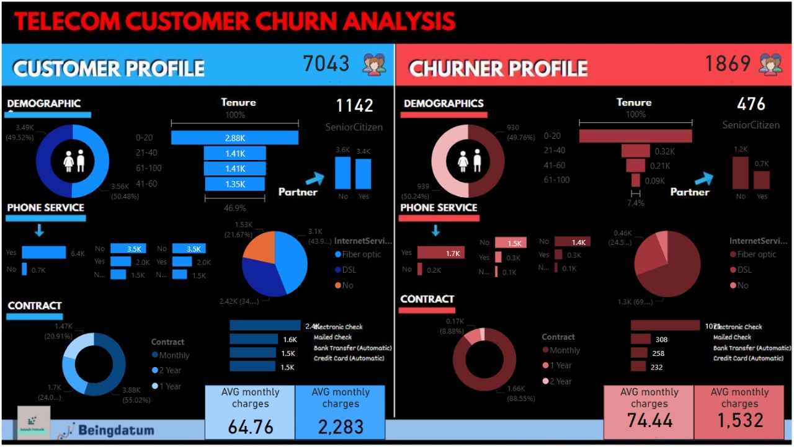

# POWER BI Tutorial

These sessions are about understanding how SQL plays a vital role in the field of data science & how SQL can be used to store, access and retrieve data to perform data analysis.

Agenda:

1. Introduction to Power BI
2. Power BI Desktop
3. Power BI Service
4. Integration 
5. Administration
6. Creating Columns, Measures
7. DAX
8. Advanced DAX
9. Build a Live Dashboard on a real life use case - Part 2

## Part 1: 
https://www.youtube.com/watch?v=Dryfm9VaEw4&t=56s

## Part 2: 
https://www.youtube.com/watch?v=mAPcW_YDUKQ

